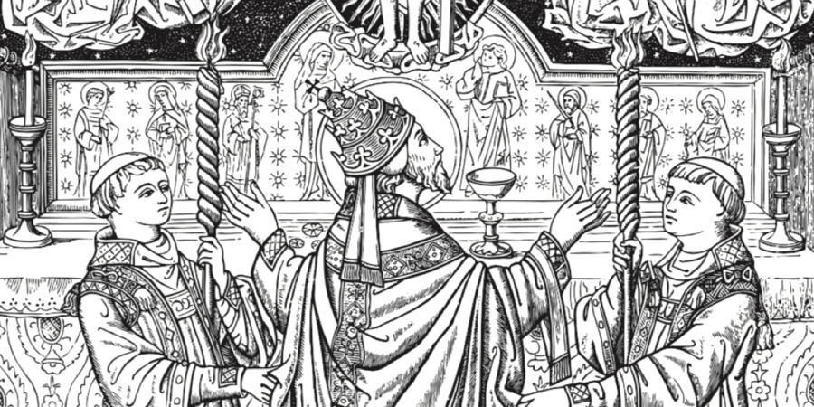

import LinkCard from "~/components/LinkCard";

import InteractiveCard from "~/components/InteractiveCard";

<InteractiveCard client:only="react" />

  <LinkCard href="/missal" title="Missal" />
  <LinkCard href="/ritual" title="Ritual" />
  <LinkCard href="/fe" title="Fé" />
  <LinkCard href="/canticos" title="Cânticos" />
  <LinkCard href="/devocionario" title="Devocionário" />
  <LinkCard href="/calendario" title="Calendário" />

