:::note
No início:
:::

Meu Senhor e meu Deus, sob o olhar amoroso de Nossa Mãe, dispomo-nos a acompanhar-Vos pelo caminho de dor que foi o preço do nosso resgate.
Queremos sofrer tudo o que Vós sofrestes, oferecer-Vos o nosso pobre coração, contrito, porque sois inocente e vais sofrer por nós, que somos os únicos culpados.

Minha Mãe, Virgem dolorosa, ajudai-me a reviver aquelas horas amargas que o vosso Filho quis passar na terra, para que nós, feitos de um punhado de lodo, vivêssemos por fim _in libertatem gloriæ filiorum Dei_ (na liberdade e glória dos filhos de Deus.).

:::note
Depois de enunciar cada Estação:
:::

  
    ℣. Adorámus te, Christe, et benedicimus tibi.
  
  
    ℣. Nós Vos adoramos, ó Jesus, e Vos bendizemos.
  
  ℟. Quia per Crucem tuam redemísti mundum.
  
    ℟. Porque pela vossa Santa Cruz redimistes o mundo.
  

:::note
No fim de cada Estação:
:::

  Pai nosso, Ave Maria, Glória.
  ℣. Miserére nostri, Dómine.
  ℣. Senhor tende piedade de nós.
  ℟. Miserére nostri.
  ℟. Tende piedade de nós.

## Estação 1

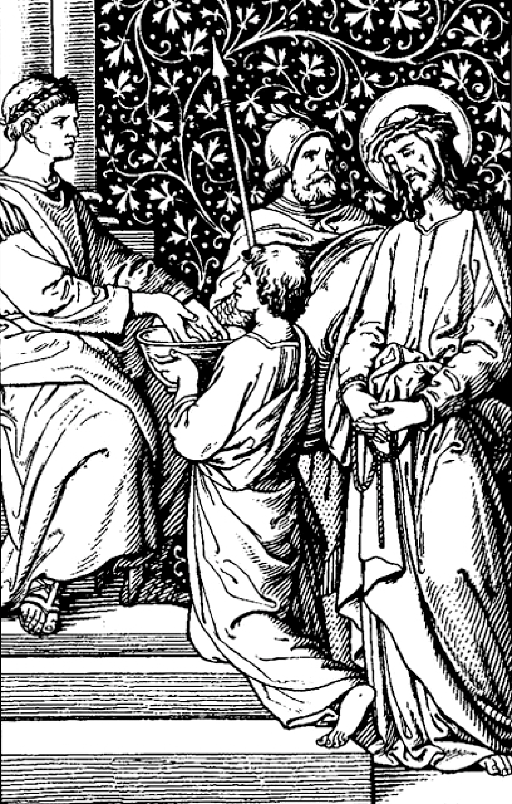

Nesta primeira estação contemplemos N. S. J. C., que, depois de cruelmente açoitado e coroado de espinhos, é levado pela segunda vez à presença de Pilatos, que por instigação dos judeus O condena à morte.
E Jesus, que quere padecer e morrer para nos provar o seu amor e livrar-nos do Inferno, submete-se à condenação!...
Ó misericordiosíssimo Jesus, fazei-nos compreender o vosso amor, e abrasai-nos nele.

## Estação 2

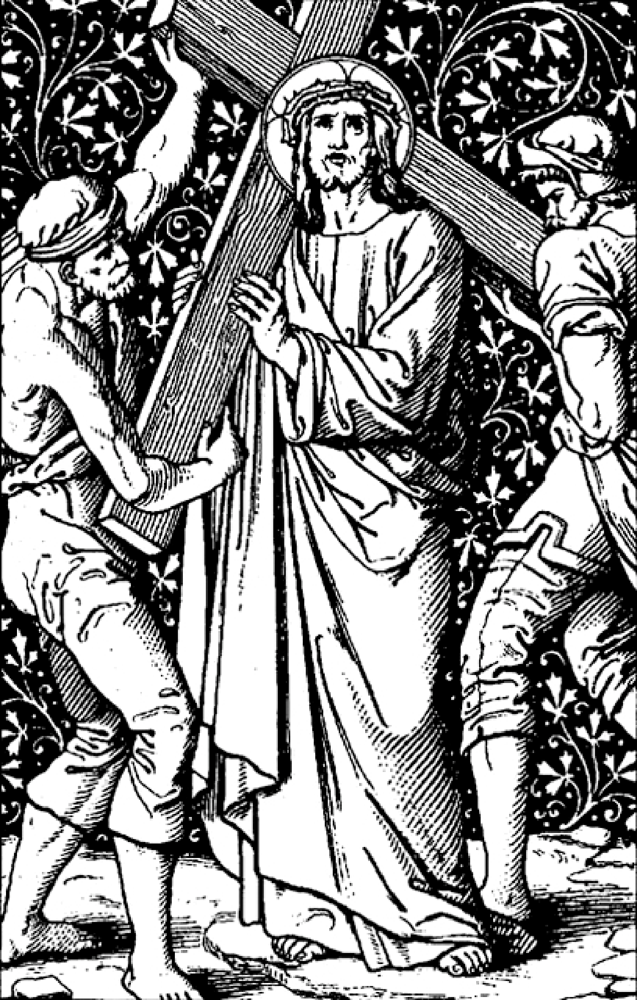

Nesta segunda estação contemplemos N. S. J. C., tratado com desprezo pelos algozes, que O obrigam a levar às costas, sobre as chagas vivas dos açoites, a pesadíssima Cruz em que vai ser crucificado para nos salvar!
Ó misericordiosíssimo Jesus, ajudai-nos a sofrer generosamente por vosso amor os desprezos e humilhações de cada dia.

## Estação 3

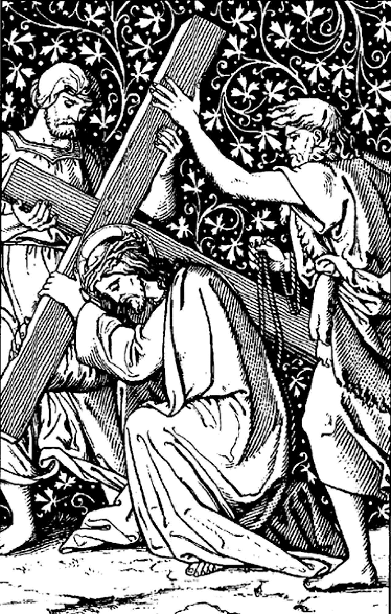

Nesta terceira estação contemplemos N. S. J. C., arrastado e empurrado pelos algozes! Então cai sob o peso da Cruz e fere os joelhos nas pedras do caminho!...
Ó misericordiosíssimo Jesus, pelas vossas chagas, concedei-nos a graça de detestar o pecado para melhor correspondermos ao vosso amor.

## Estação 4

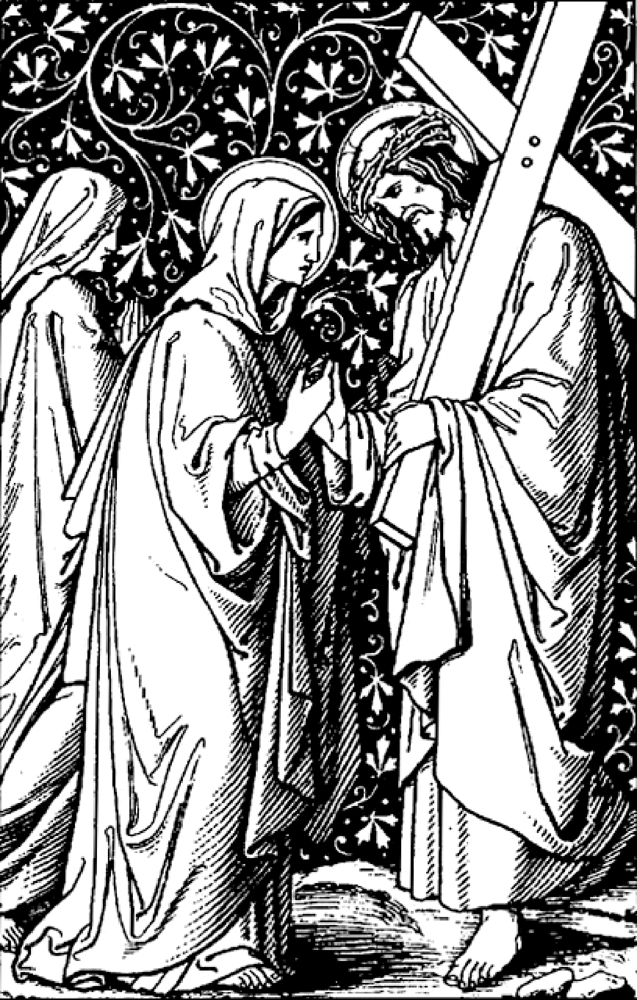

Nesta quarta estação contemplemos N. S. J. C., rodeado de seus inimigos e todo pisado e ensanguentado. Encontra sua Mãe, que num impulso de amor e dor corre pare Ele através da multidão, que cruelmente O escarnece e se regozija com o sofrimento daquela terna Mãe e do seu carinhoso Filho!...
Jesus e Maria, assisti-nos na última agonia.

## Estação 5

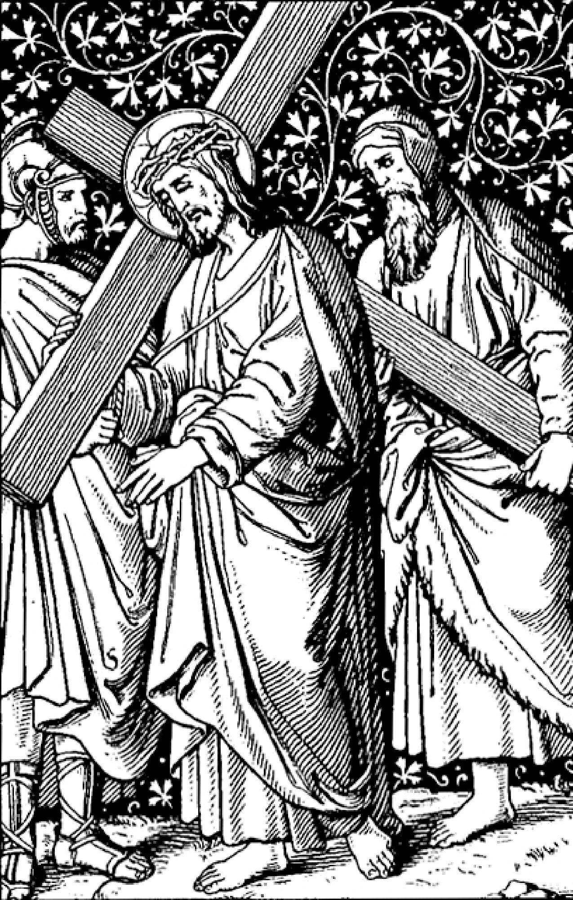

Nesta quinta estação contemplemos N. S. J. C., vergado sob o peso da Cruz e atormentado com as dores da grande chaga que ela abriu emseu ombro. Mal se mexe; já não pode caminhar; e os algozes, temendo que morra antes de ser crucificado, intimam Simão Cireneu a que O ajude!...
Ó misericordiosíssimo Jesus, ajudai-nos a levar a cruz, que for da vossa vontade enviar-nos.

## Estação 6

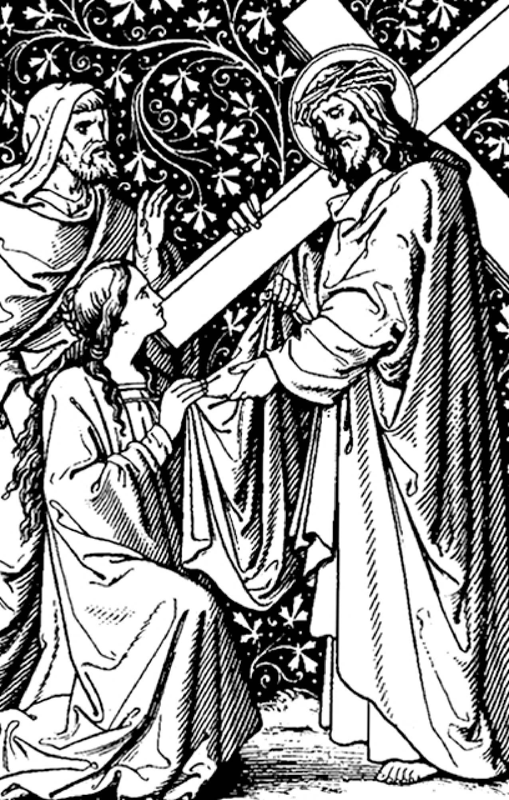

Nesta sexta estação contemplemos N. S. J. C., que deixa seu retracto estampando no véu que uma caridosa mulher Lhe ofereceu, para limpar o rosto do suor e sangue que Lhe toldavam a vista!...
Ó misericordiosíssimo Jesus, imprimi na nossa alma a vossa imagem, desfigurada pelos tormentos, para que nunca esqueçamos o que sofrestes por amor de nós.

## Estação 7

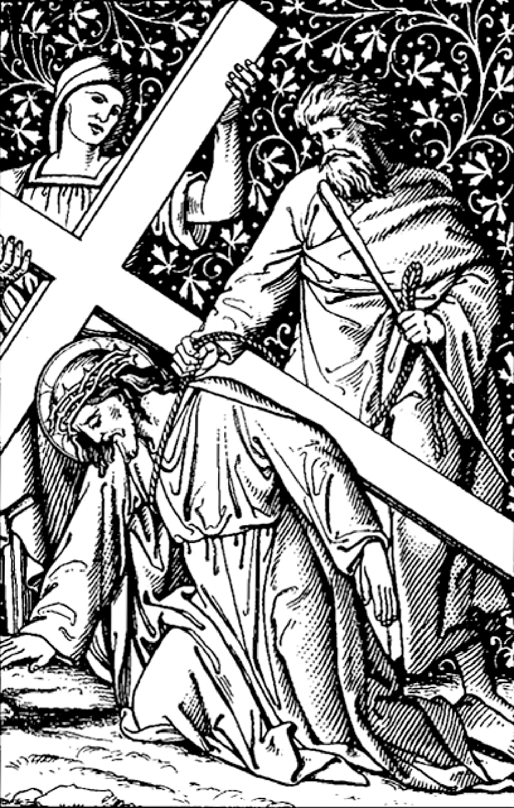

Nesta sétima estação contemplemos N. S. J. C., exausto de forças, desfalecido e caído por terra, atordoado pela algazarra infernal da plebe, que O insulta e Lhe escarra no rosto. Os algozes, impacientes por chegarem ao Calvário, violentamente O levantam, descarregando-lhe murros e pontapés!...
Ó misericordiosíssimo Jesus, nos não deixes desfalecer no vosso serviço. Conformai-nos em tudo com vossa santíssima vontade.

## Estação 8

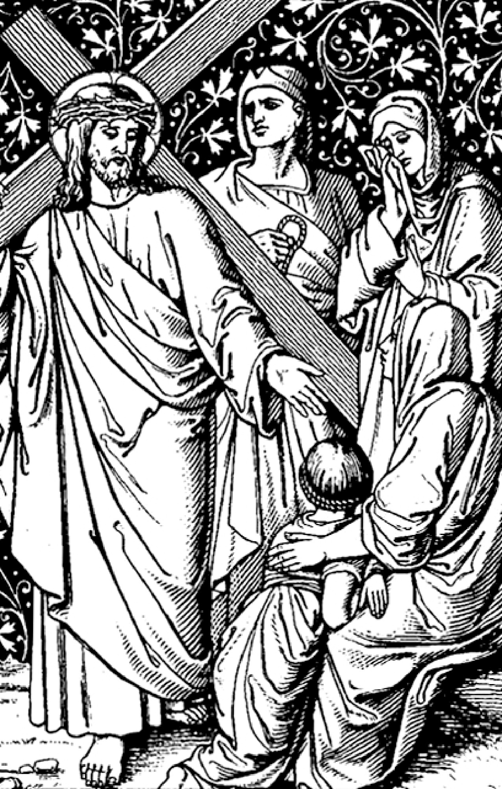

Nesta oitava estação contemplemos N. S. J. C., que esquece as suas dores para se compadecer das piedosas mulheres, que por Ele choram, e lhes diz: Filhas de Jerusalém, não choreis sobre Mim; chorai sobre vós mesmas e sobre vosso filhos!...
Ó misericordiosíssimo Jesus, dai-nos lágrimas de sincero arrependimento, para chorar os nossos pecados, causa dos vossos tormentos.

## Estação 9

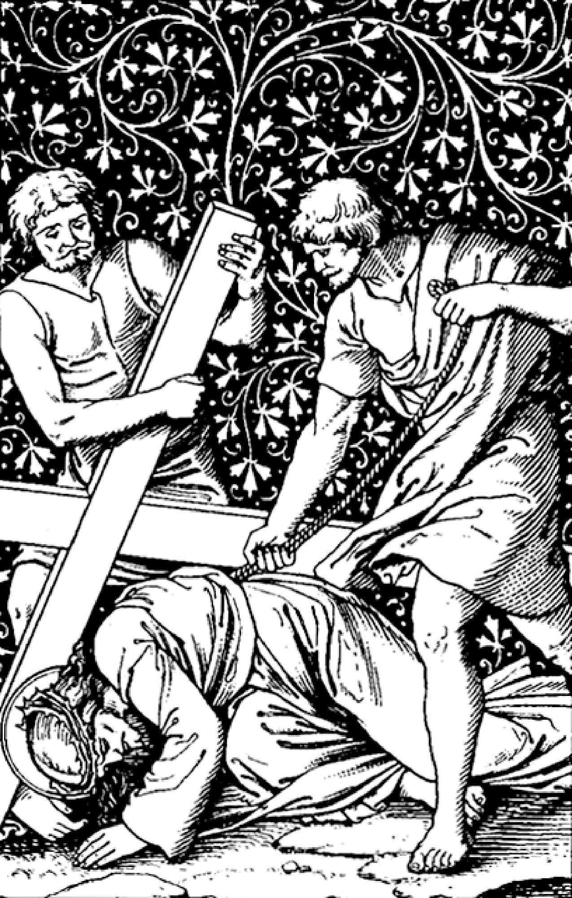

Nesta nona estação contemplemos N. S. J. C., que chega ao Calvários, banhado em sangue, e mais morto que vivo; e, não podendo aguentar de pé os empurrões e pancadas que Lhe dão os algozes, cai desamparado e chegar a tocar a terra com sua santíssima boca!...
Ó misericordiosíssimo Jesus, pelas vossas chagas Vos pedimos que tenhais compaixão dos que caíram em pecado e nele vivem; salvai-nos!

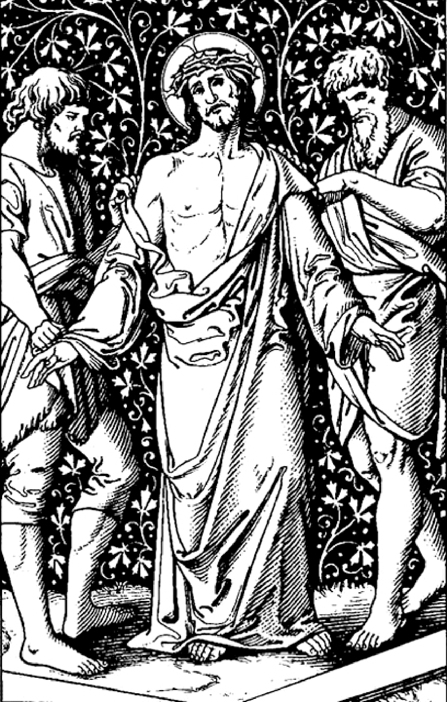

Nesta décima estação contemplemos N. S. J. C., cruelmente despojado de seus vestidos, que estavam colados às feridas, as quais novamente sangram, fazendo-o tremer com dores!...
Ó misericordiosíssimo Jesus, despojai-nos do orgulho, da vaidade e dos respeitos humanos com que tanto Vos temos ofendido e atraiçoado.

## Estação 11

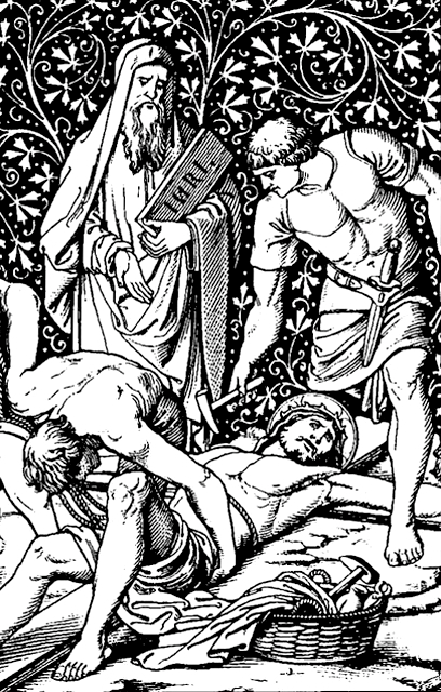

Nesta décima primeira estação contemplemos N. S. J. C., pregado na Cruz tão barbaramente que Lhe deslocam os ossos. Maria Santíssima, com o coração despedaçado de dor, ouve as pancadas do martelo que enterram os cravos nas mãos e pés doseu amado Filho, Lhe não podendo valer!...
Ó Santa Mãe das dores, gravai em meu coração as chagas do Salvador.

## Estação 12

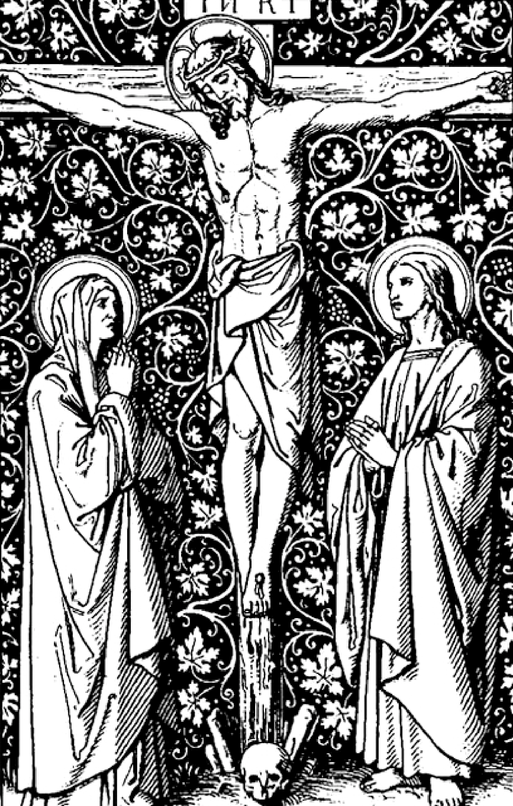

Nesta décima segunda estação contemplemos N. S. J. C., levantado na Cruz e exposto entre dous ladrões ao escárnio e insultos da plebe, até exalar o último suspiro!...
Ó clementíssimo Jesus, que Vos abrasais em ardente amor pelas almas, eu Vos suplico pela agonia do vosso Santíssimo coração e pelas dores de vossa Mãe Imaculada, que purifiqueis no vosso Sangue todos os pecadores do mundo que neste momento estão em agonia e hoje hão-de morrer.

## Estação 13

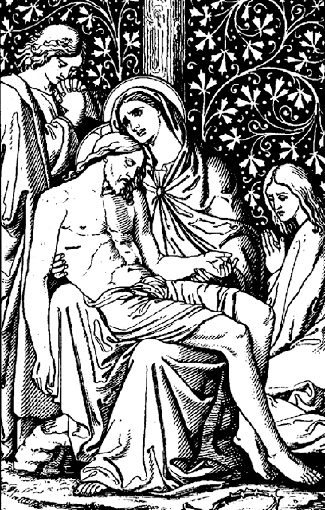

Nesta décima terceira estação contemplemos N. S. J. C., despregado piedosamente da Cruz pelos seus amigos e depositado no regaço de sua Mãe, que, banhada em lágrimas, beija e abraça o corpo deseu Filho, denegrido com pancadas e coberto de feridas, e algumas tão profundas que deixam ver os seus ossos!...
Ó Santa Mãe das dores, rogai a Jesus que nos perdoe os pecados, nos ajude a imitar as vossas virtudes, nos conceda a graça da perseverança final e nos purifique com seu precioso Sangue, para podermos satisfazer à sua justiça e gozá-lo no Céu por toda a eternidade. Ó Jesus, por amor de Maria nossa mãe, concedei-nos esta graça.

## Estação 14

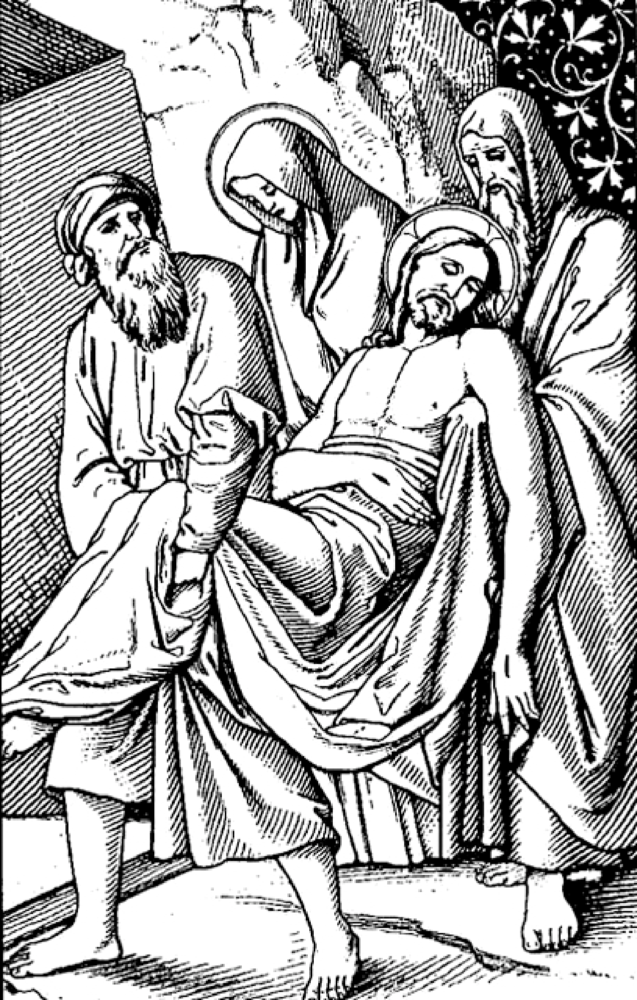

Nesta décima quarta estação contemplemos N. S. J. C. no sepulcro, e Maria Santíssima mais que nunca angustiada em triste saudade!...
Ó Mãe, fonte de amor, fazei que eu sinta as vossas fortes dores e convosco chore.
Pai eterno, misericórdia, pelo precioso sangue de Jesus.

### Oração final

:::note
Depois desta Estação, reza-se o Pai nosso... a Ave Maria... e a Glória ao Pai... cinco vezes, em honra das cinco chagas de nosso Senhor Jesus Cristo. Mais um Pai nosso, uma Ave Maria e uma Glória ao Pai pelas intenções do Santo Padre, terminando-se com a seguinte oração:
:::

  Orémus.
  Oremos.
  
    Respice, quǽsumus Dómine, super hanc famíliam tuam, pro qua Dominus noster
    Jesus Christus non dubitavit manibus tradi nocentium et Crucis subire
    tormentum. Qui tecum vivit et regnat in unitate Spíritus Sancti, Deus, per
    ómnia sǽcula sæculórum.
  
  
    Senhor, dignai-Vos lançar um olhar sobre a vossa família pela qual nosso
    Senhor Jesus Cristo não duvidou entregar-se às mãos dos ímpios e de sofrer o
    suplício da cruz. Que vive e reina na unidade do Espírito Santo, Deus, por
    todos os séculos dos séculos.
  
  ℟. Amen.
  ℟. Amen.

