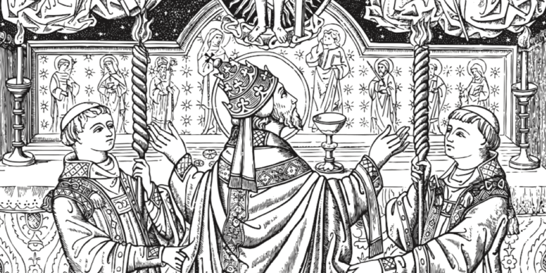

import { getCalendarDay } from "../../../lib/getCalendar.ts";
import { yyyyMMDD } from "../../../lib/src/utils.ts";

import { getHours, getMinutes } from "date-fns";

import { Card, CardGrid, LinkCard } from "@astrojs/starlight/components";

export const date = new Date();

export function getPrayerTimeCategory(date) {
  const hour = getHours(date);
  const title = "Pequeno Ofício de Nossa Senhora";
  if (hour >= 0 && hour < 3) {
    return (
      <LinkCard
        title={title}
        description="Matina"
        href="/devocionario/oficio/matinas"
      />
    );
  } else if (hour >= 3 && hour < 6) {
    return (
      <LinkCard
        title={title}
        description="Lauds"
        href="/devocionario/oficio/lauds"
      />
    );
  } else if (hour >= 6 && hour < 9) {
    return (
      <LinkCard
        title={title}
        description="Prima"
        href="/devocionario/oficio/prima"
      />
    );
  } else if (hour >= 9 && hour < 12) {
    return (
      <LinkCard
        title={title}
        description="Terça"
        href="/devocionario/oficio/terca"
      />
    );
  } else if (hour >= 12 && hour < 15) {
    return (
      <LinkCard
        title={title}
        description="Sexta"
        href="/devocionario/oficio/sexta"
      />
    );
  } else if (hour >= 15 && hour < 18) {
    return (
      <LinkCard
        title={title}
        description="Noa"
        href="/devocionario/oficio/noa"
      />
    );
  } else if (hour >= 18 && hour < 21) {
    return (
      <LinkCard
        title={title}
        description="Vésperas"
        href="/devocionario/oficio/vesperas"
      />
    );
  } else {
    return (
      <LinkCard
        title={title}
        description="Completas"
        href="/devocionario/oficio/completas"
      />
    );
  }
}

export const calendar = getCalendarDay(
  new Date(date).getFullYear(),
  yyyyMMDD(new Date()),
);

export function getPrayer(date) {
  const hour = getHours(date);
  const minute = getMinutes(date);
  // Morning is considered between 6:30 AM and 9:30 AM
  const isMorning = hour >= 5 && hour < 10;
  if (isMorning) {
    return (
      <LinkCard title="Oração da Manhã" href="/devocionario/dia/oracaomanha" />
    );
  }
  // Night is considered between 8:00 PM and 3:00 AM
  const isNight = hour >= 20 && hour <= 3;
  if (isNight) {
    return (
      <LinkCard title="Oração da Noite" href="/devocionario/dia/oracaonoite" />
    );
  }
}

export function getAngelus(date) {
  const hour = getHours(date);
  // Angelus is traditionally prayed at 6:00 AM, 12:00 PM (noon), and 6:00 PM
  const isAngelus = hour === 6 || hour === 12 || hour === 18;
  if (isAngelus) {
    return <LinkCard title="Angelus" href="/devocionario/dia/angelus" />;
  }
}

<Card title="Dia e hora" icon="information">
  <caption>
    {new Date().toLocaleString("pt", {
      weekday: "long",
      month: "long",
      day: "numeric",
      hour: "numeric",
    })}
  </caption>
  
  <LinkCard
    href={`/missal/dia#${yyyyMMDD(date)}`}
    title={
      calendar.celebration[0]?.title ||
      calendar.tempora[0]?.title ||
      calendar.commemoration[0]?.title ||
      "Feria"
    }
    description={calendar.commemoration[0]?.title}
  />
  {getPrayerTimeCategory(new Date())}
  {getAngelus(new Date())}
  {getPrayer(new Date())}
</Card>

<Card title="Ir para" icon="open-book">

  <LinkCard href="/missal" title="Missal" />
  <LinkCard href="/ritual" title="Ritual" />
  <LinkCard href="/fe" title="Fé" />
  <LinkCard href="/canticos" title="Cânticos" />
  <LinkCard href="/devocionario" title="Devocionário" />
</Card>
